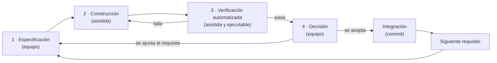

# Metodología de desarrollo de KAI

## 1. Síntesis

> Se adoptó una **metodología ágil híbrida**: planificación por fases e hitos —incluido
> el asociado al financiamiento Venture— y ejecución iterativa e incremental con
> validación continua ante los interesados. A partir de la incorporación de desarrollo
> asistido por inteligencia artificial, la ejecución pasó a un **flujo continuo de ciclos
> cortos** —especificación, construcción, verificación automatizada y decisión humana—,
> en el que cada requisito se integró una vez verificado.

El resto de este documento desarrolla esa afirmación, la divide por períodos y la
sostiene con evidencia. Distingue dos tipos de fuente:

- **Verificable en el proyecto**: la historia del repositorio (39 commits entre el
  29-03-2026 y el 20-09-2026), las suites de verificación y el trabajo técnico documentado.
- **Declarado por el equipo**: las reuniones con los interesados, la adjudicación del
  fondo Venture y la fecha de contratación de Claude Code. No dejan rastro en el
  repositorio; se indican como declaración.

---

## 2. Por qué «híbrida»

La metodología combina dos lógicas que operan en niveles distintos:

| Nivel | Lógica | Qué gobierna |
|---|---|---|
| **Estratégico** | Planificación por fases e hitos | Qué se construye en cada etapa del proyecto, en qué orden y contra qué compromisos externos (avances de tesis, financiamiento) |
| **Operativo** | Ejecución ágil, iterativa e incremental | Cómo se construye cada funcionalidad: en incrementos pequeños, entregando software funcional y ajustándolo con retroalimentación |

Un proyecto de título financiado no puede prescindir del nivel estratégico: tiene fechas
de entrega académicas, compromisos con el fondo y una contraparte institucional que
espera resultados en momentos concretos. Pero tampoco puede fijar de antemano todos sus
requisitos: la contraparte descubre lo que necesita al usar el prototipo. La combinación
responde a ambas restricciones. Las **fases** fijan el rumbo y los **ciclos** absorben el
cambio dentro de cada fase.

Por eso no corresponde a ninguno de los dos extremos:

- **No es cascada.** En cascada, el software funcional aparece al final, tras cerrar
  requisitos y diseño. En KAI hubo un MVP a las dos semanas de iniciado el desarrollo, y
  los requisitos siguieron cambiando después de construir: el glosario multidisciplinario,
  la vista predeterminada de Tendencias, la navegación adaptable, el selector de modos de
  Simulación.
- **No es Scrum estricto.** Scrum exige sprints de duración fija con planificación,
  revisión y retrospectiva formales. La cadencia de commits no muestra ese ritmo: hay un
  mes sin actividad y días con seis integraciones. Sí se cumple el principio ágil de
  revisión frecuente con los interesados, mediante las reuniones con la contraparte.

---

## 3. Línea de tiempo

```
2026    mar      abr            may     jun     jul       ago            sep
        │        ████████████           ▪       ▪▪▪       ███████        █████████
        │        18 commits             1       3         7              9
        │        MVP 12-04                                chatbot 05-08  6 el 07-09
        ├─ P1 ──┼─── P2 ──────┼──────── P3 ──────────┼──── P4 ──────────────────────┤
     Formulación  Construcción   Validación y refinamiento   Desarrollo asistido por IA
                  incremental                     ▲
                                        Hito: fondo Venture y
                                        contratación de Claude Code
```

| Período | Fechas | Commits | Metodología dominante |
|---|---|---:|---|
| P1 — Formulación y planificación | marzo 2026 | 1 | Planificación por fases; levantamiento de requisitos |
| P2 — Construcción incremental del MVP | abril 2026 | 18 | Desarrollo incremental con entrega temprana |
| P3 — Validación y refinamiento | mayo–julio 2026 | 4 | Prototipado evolutivo guiado por retroalimentación |
| P4 — Desarrollo asistido por IA | agosto–septiembre 2026 | 16 | Flujo continuo de ciclos cortos con verificación automatizada |

---

## 4. Período 1 — Formulación y planificación (marzo)

**Qué ocurrió.** Se constituyó el repositorio (commit inicial del 29-03) y se definió el
proyecto: problema, objetivos, requisitos funcionales y no funcionales, arquitectura de
referencia y plan de fases con carta Gantt.

**Metodología.** Planificación por fases. Es la parte «tradicional» del enfoque híbrido y
la adecuada para este momento: antes de construir hace falta un marco común con la
contraparte sobre qué problema se resuelve y qué se entregará.

**Participación de los interesados** *(declarado)*. Entrevistas con la unidad de análisis
institucional de la PUCV para identificar necesidades, y reuniones semanales con el
Director de Innovación y Vinculación con la Industria de la Facultad de Ingeniería y con
el profesor guía.

**Salida.** Documento de requisitos, backlog priorizado por valor para el usuario
—extracción de datos, visualización, simulación y, al final, el asistente— y entorno de
desarrollo configurado.

---

## 5. Período 2 — Construcción incremental del MVP (abril)

**Qué ocurrió.** Es el período de mayor densidad de commits: 18 en un mes. La secuencia
muestra la construcción por incrementos:

| Fecha | Commit | Incremento |
|---|---|---|
| 11-04 | «Visualizador de tendencias» | Primer módulo funcional |
| 12-04 | «MVP FUNCIONAL COMPLETO» | Producto mínimo utilizable |
| 14-04 | «Métricas transversales y Landing page» | Segundo módulo y portada |
| 24-04 | «Adaptar para correr local y en nube» | Despliegue |
| 27–29-04 | Arreglos de gráfico, estética, responsividad | Pulido sobre lo construido |

**Metodología.** Desarrollo **incremental con entrega temprana**. El rasgo decisivo es que
existió un producto funcional a las dos semanas del primer commit de desarrollo, y que
cada commit posterior **añade o mejora** sobre algo que ya funciona, en lugar de completar
una pieza que no podía usarse antes.

**Justificación.** La entrega temprana permite mostrar el software a la contraparte y
recoger retroalimentación sobre algo concreto, no sobre una especificación. Es el insumo
del período siguiente.

---

## 6. Período 3 — Validación y refinamiento (mayo–julio)

**Qué ocurrió.** La actividad en el repositorio baja: ningún commit en mayo, uno en junio
y tres en julio. Los mensajes indican ajustes motivados por el uso:

| Fecha | Commit |
|---|---|
| 07-06 | «Cambios análisis institucional» |
| 18-07 | «Regresion Lineal» |
| 20-07 | «Tabla simulación free» |

**Metodología.** **Prototipado evolutivo guiado por retroalimentación.** El prototipo no se
descarta ni se rehace: se somete a uso y se modifica según lo que ese uso revela. El
nombre del commit de junio lo dice de forma literal.

**Participación de los interesados** *(declarado)*. Sesiones de uso del prototipo con la
unidad de análisis institucional sobre los módulos de visualización y simulación.

**Lectura del ritmo.** Un período de baja actividad en el repositorio es coherente con una
fase de validación: el tiempo se dedica a mostrar, observar y decidir, y menos a escribir
código. También puede corresponder a trabajo no confirmado en el repositorio; git registra
cuándo se integra el trabajo, no cuándo se realiza.

---

## 7. Hito — Financiamiento Venture y contratación de Claude Code

*(Declarado por el equipo.)* Tras la adjudicación del fondo Venture se contrató Claude
Code como herramienta de desarrollo asistido por inteligencia artificial.

El hito coincide con el cambio de ritmo que muestra el repositorio: de 4 commits en tres
meses (mayo–julio) a 16 en siete semanas (agosto–septiembre), y con la incorporación de
las funcionalidades de mayor complejidad técnica —el asistente conversacional, la
autenticación, los planes y la verificación automatizada—.

Es un hito estratégico en el sentido del nivel de planificación: modifica los recursos
disponibles y, con ellos, el alcance que el proyecto puede asumir en el tiempo restante.

---

## 8. Período 4 — Desarrollo asistido por IA (agosto–septiembre)

**Qué ocurrió.**

| Fecha | Incremento |
|---|---|
| 05-08 | Incorporación de QS Global y Shanghai GRAS; **incorporación del chatbot** |
| 18–20-08 | Cambios de usabilidad; encabezado |
| 05-09 | Reajustes de aspecto visual |
| **07-09** | **Seis commits en un día**: lógica de usuarios con JWT, su corrección, corrección de sesión, segundo motor (Gemini), mensajes del asistente, nueva portada y corrección del glosario |
| 10-09 | Configuración de agentes y corrección de limitaciones de la verificación |
| 20-09 | Modo claro |

Además del código, este período produjo la verificación ejecutable del sistema: **347
comprobaciones** organizadas en dos ejecutores y un flujo de integración continua.

**Metodología.** **Flujo continuo de ciclos cortos con verificación automatizada y decisión
humana.** Se describe en detalle en la sección siguiente.

---

## 9. El ciclo: especificación, construcción, verificación automatizada y decisión humana

### 9.1 Esquema



Cada vuelta completa dura **horas, no semanas**. El ciclo tiene dos bucles de retroceso:

- **Verificación → construcción**, cuando una comprobación falla. Es el bucle técnico: el
  requisito es correcto, pero la implementación no lo cumple todavía.
- **Decisión → especificación**, cuando el equipo revisa el resultado y cambia lo que
  pide. Es el bucle de negocio: la implementación cumple lo pedido, pero lo pedido no era
  exactamente lo que se necesitaba.

### 9.2 Fase 1 — Especificación (equipo)

**Qué es.** El equipo formula un requisito en lenguaje natural: qué se quiere, con qué
restricciones y qué no debe cambiar.

**Por qué es humana.** Contiene el conocimiento del dominio y del negocio que la
herramienta no tiene: qué necesita la unidad de análisis institucional, qué decisión
comercial se ha tomado, qué es aceptable para la contraparte.

**Ejemplos reales:**

- *Segundo motor*: «el modelo más barato en proporción de tokens», que conviva con el
  primero sin errores, que no se pueda alternar dentro de una conversación, pero que se
  pueda **derivar** un mensaje a una conversación nueva con el otro motor. La
  especificación trae ya las reglas de diseño que la construcción debe respetar.
- *Vista de Tendencias*: intercambiar el orden de las vistas «sin alterar su aspecto ni
  funcionalidad». La restricción negativa acota el cambio.
- *Simulación*: un selector de modo «idéntico» al de Tendencias, dejando un ítem único en
  el encabezado.

**Criterio de salida.** Un requisito lo bastante preciso como para que su cumplimiento sea
comprobable.

### 9.3 Fase 2 — Construcción (asistida)

**Qué es.** La herramienta implementa el requisito sobre el código existente: lee el
contexto, propone y aplica los cambios, y documenta en el propio código las decisiones no
evidentes.

**Qué aporta la asistencia.** Velocidad sobre tareas de alto volumen y bajo margen de
error aceptable —integración de SDK, consultas, componentes de interfaz, migraciones— y
coherencia con las convenciones del código existente.

**Criterio de salida.** El código compila y está listo para ser verificado. Nunca se
considera terminado en esta fase.

### 9.4 Fase 3 — Verificación automatizada (asistida y ejecutable)

**Qué es.** El resultado se contrasta contra el sistema real antes de presentarlo como
terminado: la base de datos, un navegador conducido de forma programática o el proveedor
externo.

**Por qué es la fase que distingue el método.** La velocidad de construcción solo es útil
si lo construido es correcto. Sin esta fase, la asistencia multiplica la producción de
código y también la de defectos. La verificación es lo que convierte la velocidad en
avance.

**Principio aplicado.** La ausencia de errores no prueba que el código funcione. Se
verifica la **propiedad** que el requisito exige, medida sobre el sistema real.

**Ejemplos reales de defectos detectados en esta fase**, que no habrían aparecido al
revisar el código:

| Técnica | Qué reveló |
|---|---|
| Ejecución concurrente | Con un tope diario de 5 consultas, 12 peticiones simultáneas dejaban pasar 8. Se resolvió con un cerrojo por usuario; la misma prueba acepta ahora exactamente 5 |
| Verificación adversaria | Una forma válida de escribir SQL —identificadores entre comillas— eludía la lista de tablas permitidas del asistente. Se cerró antes de integrarse |
| Contra el proveedor real | El modelo económico elegido figuraba en el catálogo del proveedor pero había sido retirado para cuentas nuevas; solo una consulta real lo reveló |
| Contra el proveedor real | La cuota de búsqueda web del proveedor, independiente de la de tokens, dejaba inoperativo el motor económico al agotarse. Se añadió un repliegue |
| Contraste independiente en SQL | La agregación del glosario para rankings multidisciplinarios se validó recalculándola por separado: las cinco dimensiones suman exactamente 100 % |

**Criterio de salida.** Todas las comprobaciones pasan. Si una falla, se vuelve a la
construcción.

**Una salvedad metodológica aprendida en el proceso.** Una comprobación que falla no
prueba por sí sola un defecto del producto: a veces la equivocada es la prueba. Por eso
cada comprobación nueva se valida viendo que **falla** ante la condición que pretende
detectar, antes de darla por buena.

### 9.5 Fase 4 — Decisión (equipo)

**Qué es.** El equipo revisa el resultado verificado y decide: aceptarlo e integrarlo, o
cambiar el requisito.

**Por qué es humana.** La verificación establece que el software cumple lo pedido; solo el
equipo puede establecer que lo pedido era lo correcto. Además, hay defectos que ninguna
prueba anticipa porque dependen de cómo se percibe el producto.

**Ejemplos reales:**

- *Orden de los turnos en la portada.* Las pruebas confirmaban que cada turno aparecía. El
  equipo detectó que aparecían en orden fijo y no en el orden en que se pulsaban. Se
  corrigió en la vuelta siguiente.
- *Pesos del glosario.* Ante las filas repetidas en las métricas de Shanghai GRAS, el
  diagnóstico técnico inicial fue que eran duplicados. El equipo aportó el conocimiento
  del dominio: los pesos habían cambiado en la metodología del ranking a lo largo de los
  años. El diagnóstico se corrigió y la limitación se documentó como tal.
- *Alcance.* Retirar Investigadores del encabezado, mantener gratuito el motor económico o
  no presentar la pasarela de pago fueron decisiones del equipo, no de la herramienta.

**Criterio de salida.** El equipo acepta el resultado y lo integra con un commit.

### 9.6 Integración

Un requisito se integra **solo cuando ha pasado la verificación y la decisión**. Esa es la
definición de terminado del método. La integración continua ejecuta después las
comprobaciones del backend en cada envío, de modo que un cambio posterior no pueda romper
en silencio lo ya verificado.

---

## 10. Por qué flujo continuo y no sprints

El período 4 comparte los principios de **Kanban** más que los de Scrum:

| Principio | Cómo se aplicó |
|---|---|
| **Flujo en lugar de iteraciones fijas** | Cada requisito entra cuando se formula y sale cuando está verificado y aceptado. No se espera al cierre de un sprint para integrarlo |
| **Trabajo en curso limitado** | Un requisito a la vez por ciclo. El siguiente empieza cuando el anterior está integrado |
| **Definición de terminado explícita** | Verificado y aceptado. No basta con escrito o con que compile |
| **Mejora continua** | Las lecciones de cada ciclo pasan al siguiente: validar que cada prueba falla ante lo que debe detectar, restablecer el estado del navegador entre pruebas, verificar contra el proveedor real |

Con iteraciones de horas, un sprint de dos semanas agruparía decenas de ciclos
completos y solo añadiría demora entre la aceptación de un cambio y su integración.

El método incorpora además prácticas propias de **Extreme Programming**: integración
continua, verificación automatizada escrita junto al código, entregas pequeñas y
frecuentes, y una forma de programación en pareja en la que el equipo especifica y
decide mientras la herramienta implementa y verifica.

---

## 11. Distribución de responsabilidades

| Fase | Equipo | Herramienta |
|---|---|---|
| Especificación | Formula el requisito, sus restricciones y lo que no debe cambiar | — |
| Construcción | — | Implementa sobre el código existente y documenta las decisiones |
| Verificación | Define qué se considera correcto | Escribe y ejecuta las comprobaciones contra el sistema real |
| Decisión | Acepta, rechaza o reformula | — |
| Integración | Confirma el cambio en el repositorio | — |

Las decisiones de diseño, alcance y aceptación fueron siempre del equipo. El informe de
tesis lo declara expresamente en la aclaración sobre el uso de herramientas de
inteligencia artificial.

---

## 12. Evidencia y sus límites

**Lo que el repositorio sostiene:**

- 39 commits entre el 29-03-2026 y el 20-09-2026.
- MVP funcional el 12-04, a las dos semanas del primer commit de desarrollo.
- Ritmo irregular por períodos: 18 commits en abril, 4 entre mayo y julio, 16 entre
  agosto y septiembre, 6 de ellos el 07-09.
- Incorporación del chatbot el 05-08 y de la autenticación, el segundo motor y los planes
  en septiembre.
- 347 comprobaciones automatizadas e integración continua.

**Lo que no puede establecer:**

- **Cuándo se hizo el trabajo.** Git registra la integración, no la ejecución. El vacío de
  mayo puede corresponder a trabajo no confirmado.
- **Quién hizo qué.** 38 commits están a nombre de un integrante y 1 del otro. Refleja
  desde qué cuenta se confirmó el trabajo, no el reparto real del esfuerzo.
- **Uso de la herramienta de IA.** Ningún commit lleva coautoría registrada de la
  herramienta, porque el equipo confirmaba tras revisar. Su uso consta en la declaración
  del informe.
- **Reuniones y financiamiento.** Las reuniones con los interesados, el fondo Venture y la
  fecha de contratación de Claude Code son declaraciones del equipo, no registros del
  repositorio.
- **Volumen de código.** No se usa como evidencia: los primeros meses incluyen por error el
  entorno virtual versionado, lo que distorsiona las cifras de líneas.

---

## 13. Versión breve para el informe

> Se adoptó una metodología ágil híbrida. La planificación se organizó en fases e hitos
> —formulación, construcción incremental, validación y desarrollo asistido por
> inteligencia artificial—, con el financiamiento Venture como hito que amplió los
> recursos disponibles. La ejecución fue iterativa e incremental: un producto mínimo
> funcional a las dos semanas de iniciado el desarrollo, ampliado por incrementos y
> refinado mediante la validación con la unidad de análisis institucional.
>
> Tras la incorporación de desarrollo asistido por inteligencia artificial, la ejecución
> adoptó un flujo continuo de ciclos cortos en cuatro fases: especificación del requisito
> por el equipo, construcción asistida, verificación automatizada contra el sistema real y
> decisión del equipo sobre su aceptación. Un requisito se integró solo tras superar la
> verificación y ser aceptado, y la integración continua preserva lo verificado frente a
> cambios posteriores. Las decisiones de diseño, alcance y aceptación correspondieron en
> todo momento al equipo.
