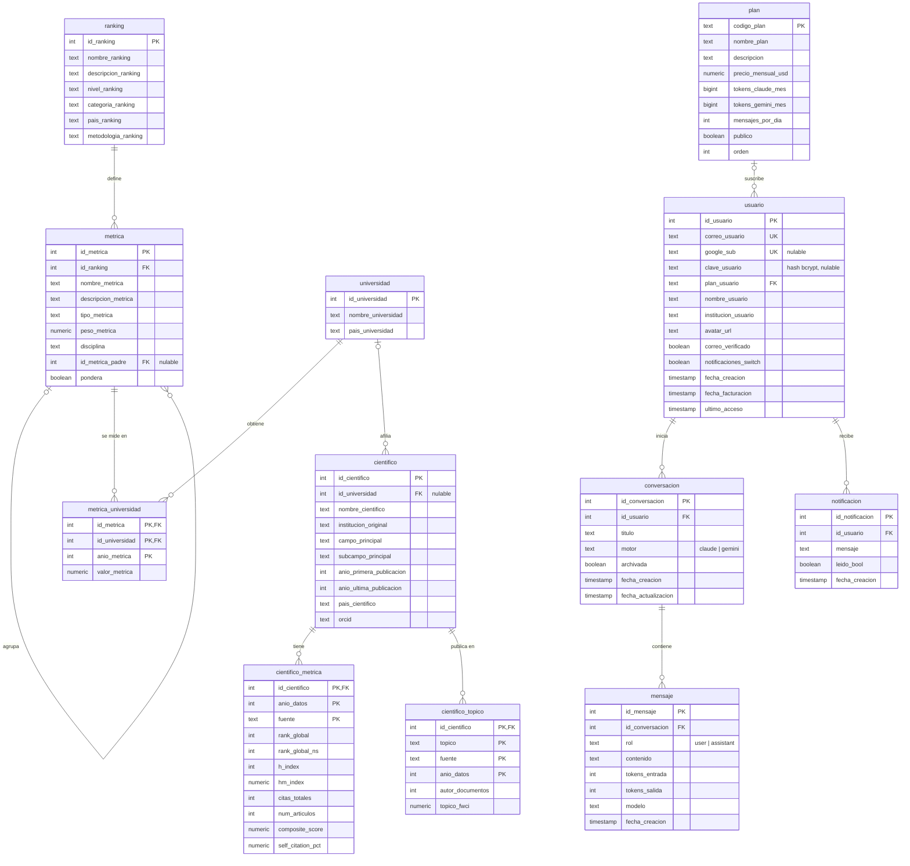

# Modelo entidad-relación

Esquema de la base de datos de KAI (PostgreSQL), extraído del esquema real el
21-09-2026. El SQL equivalente, listo para importar en herramientas de
diagramas, está en [`modelo-er.sql`](modelo-er.sql).

## Dominios

- **Rankings:** `ranking` → `metrica` → `metrica_universidad` ← `universidad`.
  `metrica_universidad` es la tabla de hechos: el valor de una métrica para una
  universidad en un año. `metrica` se referencia a sí misma: algunos rankings
  publican su metodología en dos niveles —los pilares y los indicadores que cada
  pilar agrupa—, y `id_metrica_padre` registra esa jerarquía. `pondera` marca
  cuál de los dos niveles compone el 100 % del ranking; el otro se conserva como
  referencia metodológica y queda fuera de cualquier suma de pesos.
- **Investigadores:** `cientifico` (afiliado opcionalmente a una `universidad`)
  con sus indicadores anuales por fuente (`cientifico_metrica`) y sus tópicos
  (`cientifico_topico`).
- **Usuarios y asistente:** `plan` → `usuario` → `conversacion` → `mensaje`,
  más `notificacion`. Borrar un usuario borra en cascada sus conversaciones,
  mensajes y notificaciones.
